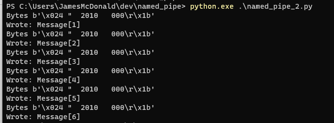
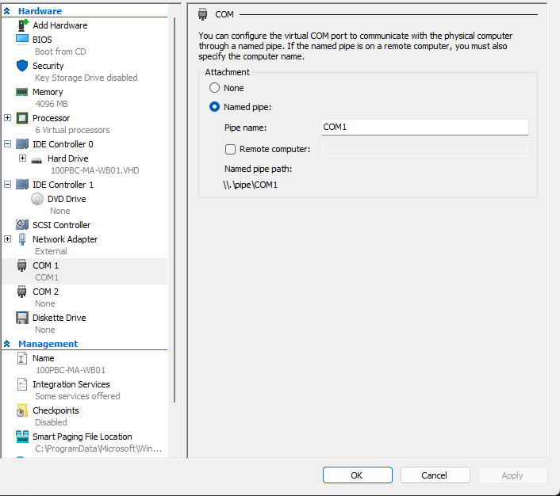

# Write to a Named Pipe Attached to Hyper-V Client COM Port using Python

# About 
These python snippets (`named_pipe_2.py` and `named_pipe.py`) simulate a continuous serial output from a Mettler Toledo IND780 Weigh Terminal being written to a Named Pipe which you can connect to a Hyper-V Guest.

This was done on Windows 11 with Python 3.11.0 

There are two methods of connecting to the named pipe as below.

The data sent is a byte string of either 20.10 tonnes or 40.10tonnes (Gross and Tare Truck weights):

```python
# 20.10
twenty = b'\x02\x34\x20\x22\x20\x20\x32\x30\x31\x30\x20\x20\x20\x30\x30\x30\x0d\x1b'
# 41.04
fourty = b'\x02\x34\x20\x22\x20\x20\x34\x31\x30\x34\x20\x20\x20\x30\x30\x30\x0d\x1b'

```

## Usage

Run your terminal as an Administrator

### Method 1

Uses `win32file.CreateFile()`

Use the `w` argument as this is the one that works.

```python
pip install -r .\requirements.txt
python named_pipe.py w
```


### Method 2

Uses `open()` and `f.write()`

```
python named_pipe_2.py

```

## Configure a Hyper-V guest to have a comport connected to a Named Pipe on the Hyper-V Host

Add as shown




### Get a list of Named Pipes using Powershell

```powershell
Get-ChildItem \\.\pipe

#output
    Directory: \\.\pipe

#...
Mode                 LastWriteTime         Length Name                                                                 
----                 -------------         ------ ----                                                                 
------         1/01/1601  11:00 AM              1 COM1                                                                 
#... 

```

```powershell

(Get-ChildItem \\.\pipe\).FullName 

# output
\\.\pipe\COM1

```


